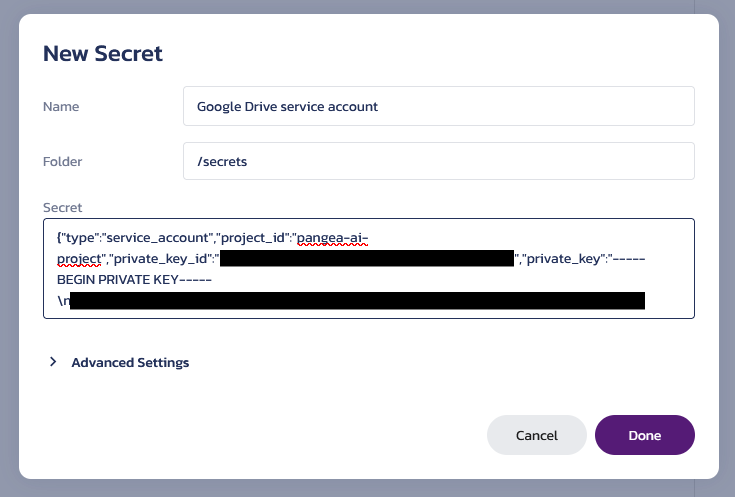

# Authenticating External Services for LangChain in JavaScript

An example JavaScript app demonstrating how to integrate Pangea's [Vault][] service
into a LangChain app to authenticate with external services.

## Prerequisites

- Node.js v22.
- A [Pangea account][Pangea signup] with Vault enabled.
- An [OpenAI API key][OpenAI API keys].
- A Google Drive folder containing documents. Note down the ID of the folder
  (see [the LangChain docs][retrieve-the-google-docs] for a guide on how to get
  the ID from the URL).
- A Google Cloud project with the [Google Drive API][] enabled.
- A Google service account with the `"https://www.googleapis.com/auth/drive.readonly"`
  scope.

The Google service account's credentials will also need to be added to Vault.
This would look like:



Save the ID of the new Vault item for later.

## Setup

```shell
git clone https://github.com/pangeacyber/langchain-js-service-authn.git
cd langchain-js-service-authn
npm install
cp .env.example .env
```

Fill in the values in `.env` and then the app can be run like so:

Let's assume we have a Google Drive document listing out the offices of some
fictional company. We can ask a question like:

```shell
npm run demo -- --googleDriveFolderId "1Kj77..." --vaultItemId "pvi_..." "What are ABC Corporation's office locations?"
```

And a sample reply would be:

```
1. Headquarters - 1000 Tech Park Drive, Silicon Valley, CA 95054, United States
2. European Office - 20 Innovation Street, Tech City, London, EC1V 9AP, United Kingdom
3. Asia-Pacific Office - 500 Business Boulevard, Marina Bay, Singapore, 018989
4. East Coast Office - 250 Business Central, 5th Avenue, New York, NY 10001, United States.
```

[Vault]: https://pangea.cloud/docs/vault/
[Pangea signup]: https://pangea.cloud/signup
[OpenAI API keys]: https://platform.openai.com/api-keys
[Google Drive API]: https://console.cloud.google.com/flows/enableapi?apiid=drive.googleapis.com
[retrieve-the-google-docs]: https://python.langchain.com/docs/integrations/retrievers/google_drive/#retrieve-the-google-docs
